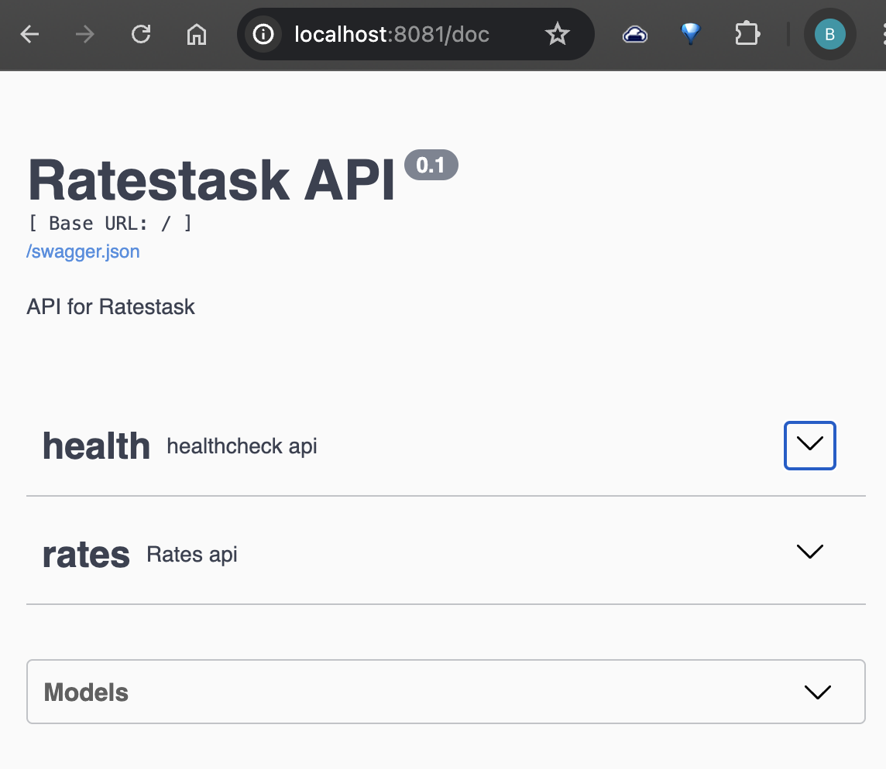
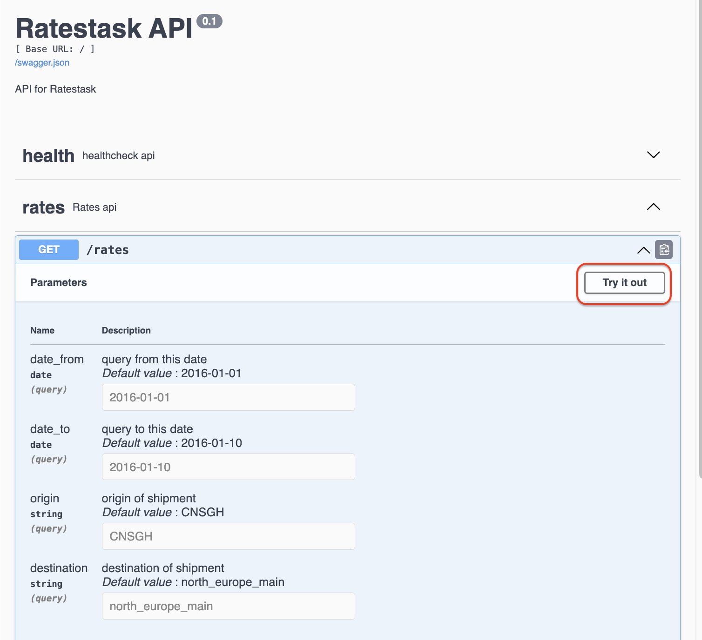
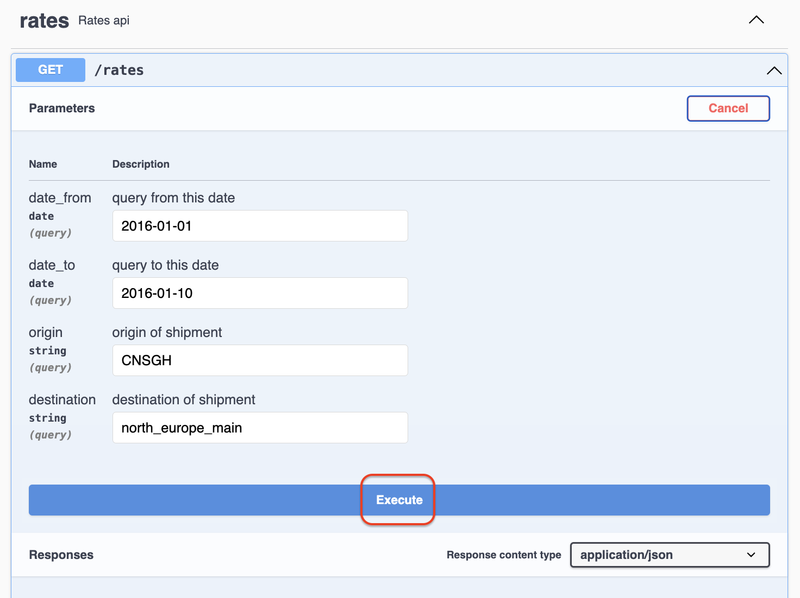

# Rates Task

## Setup

### Using Docker Compose

Build the Docker images and start the containers:
```sh                                                                                                                                           
> docker compose up                                                                                                                        
```                                                                                                                                                
                                                                                                                                          


## API Usage

### Using Swagger




Click `Try it out` button




Click `Execute` button




### Endpoint

`GET /rates`

### Parameters

- `date_from`: Start date (YYYY-MM-DD)
- `date_to`: End date (YYYY-MM-DD)
- `origin`: Origin port code or region slug
- `destination`: Destination port code or region slug

### Example

 ```sh                                                                                                                                                  
 curl "http://localhost:8081/rates?date_from=2016-01-01&date_to=2016-01-10&origin=CNSGH&destination=north_europe_main"
 ```

#### Response:
```json
 [                                                                                                                                                      
     {                                                                                                                                                  
         "day": "2016-01-01",                                                                                                                           
         "average_price": 1112                                                                                                                          
     },                                                                                                                                                 
     {                                                                                                                                                  
         "day": "2016-01-02",                                                                                                                           
         "average_price": 1112                                                                                                                          
     },                                                                                                                                                 
     {                                                                                                                                                  
         "day": "2016-01-03",                                                                                                                           
         "average_price": null                                                                                                                          
     },                                                                                                                                                 
     ...                                                                                                                                                
 ]
```


## Future improvements

### Add database connection pooling
### Add database caching
### Add HTTP cache
### Secure the APIs with authentication and authorization

